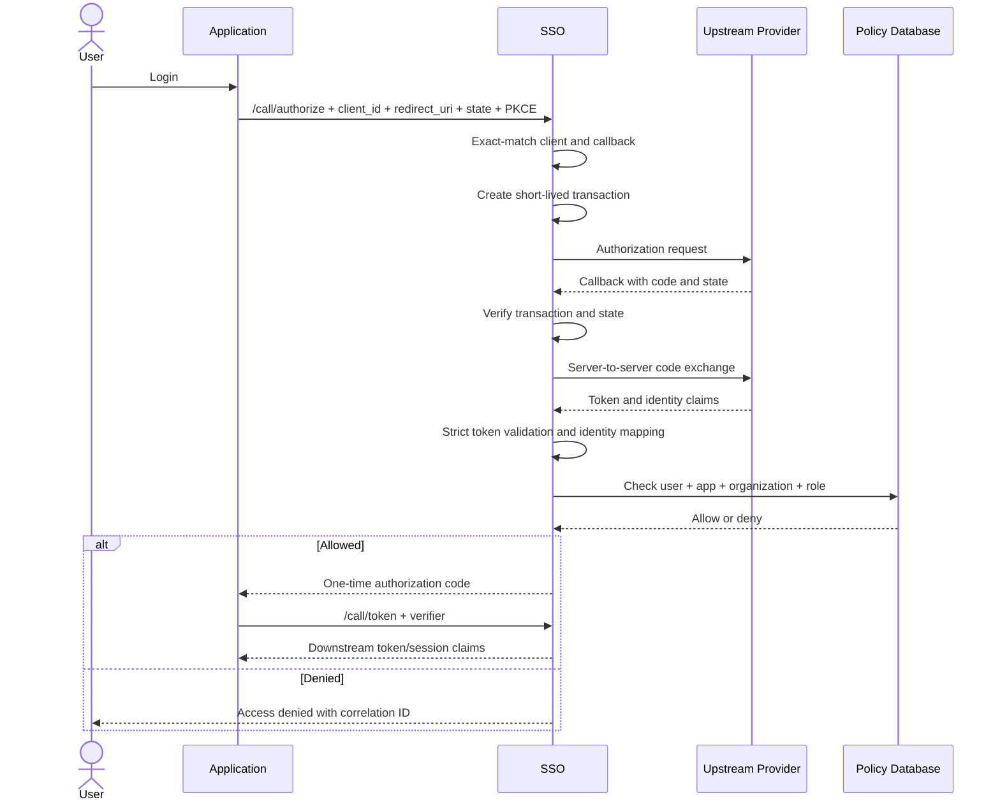

# สถาปัตยกรรม SSO

## ขอบเขตระบบ

ระบบแบ่งเป็น 5 ส่วน:

1. **Downstream OAuth 2.0 layer** ออก authorization code และ access token ให้เว็บไซต์ของหน่วยงาน
2. **Authentication broker** เลือกและเชื่อมต่อ upstream provider
3. **Identity mapping service** ผูก external subject กับ local user
4. **Authorization policy service** ตรวจสิทธิ์ตาม application, organization, role และช่วงเวลา
5. **Administration and audit** จัดการ client, callback, grant, revocation และตรวจย้อนหลัง

## ทางเลือกที่แนะนำ

ใช้ Laravel Passport 13.7.5 ซึ่งทำงานบน League OAuth2 Server สำหรับ downstream
Authorization Code flow และ cryptography ส่วนโค้ดของหน่วยงานรับผิดชอบ provider
adapter, identity mapping, policy integration, `userinfo` และ revocation

เฟสนี้ไม่อ้างว่าเป็น OpenID Connect Provider เต็มรูปแบบ เพราะยังไม่ออก `id_token`
และยังไม่มี discovery/JWKS contract เว็บไซต์ทดสอบใช้ authorization code, access token
และ `userinfo` เท่านั้น หากเว็บไซต์จริงต้องการ OIDC เต็มรูปแบบต้องผ่าน decision gate
และเพิ่ม conformance test ก่อนเปิดใช้

หากการประเมินพบว่าผลิตภัณฑ์สำเร็จรูปไม่รองรับ upstream contract ให้สร้าง broker service แยก แต่ยังใช้ library มาตรฐานสำหรับ OAuth/OIDC และ JWT ห้ามเขียน cryptographic primitive เอง

## Login flow

## Dynamic provider selection

- application configuration ระบุ provider policy ที่อนุญาต
- request อาจส่ง provider key ได้เฉพาะเมื่อ application policy อนุญาต
- provider key ถูก resolve เป็น configuration ภายในระบบ
- URL, client secret และ signing key ไม่รับจาก browser request
- transaction ต้องผูก provider, client, redirect URI และ browser session

## Provider boundary ที่ยืนยันแล้ว

ระบบแบ่ง upstream API เป็น 2 logical sections:

1. `THAID` ของกรมการปกครอง ใช้ credential และ callback ของ ThaID
2. `MOPH_ID` ของกระทรวงสาธารณสุข เป็น flow เดียวที่ใช้ Health ID
   สำหรับ authentication/token ก่อนแลก Provider ID token และอ่าน profile/organization

แม้ `MOPH_ID` ต้องใช้ `HEALTH_ID_*` และ `PROVIDER_ID_*` คนละชุดทางเทคนิค
แต่ต้องเปิด/ปิดและประเมินผลเป็น provider section เดียว ห้ามเลือก Provider ID
โดยข้ามขั้น Health ID

## Identity mapping ที่ยืนยันแล้ว

- ThaID: ตรวจ ID Token/introspection ก่อนใช้ `sub` และ `pid`
- Provider ID: ตรวจ Health ID token, แลก Provider ID token และตรวจ profile
  ก่อนใช้ `account_id` กับ `hash_cid`
- `hash_cid` ตามเอกสารเป็น SHA-256(CID); ระบบ HMAC ค่านี้ซ้ำด้วย
  `PROVIDER_CID_LOOKUP_KEY` ก่อนค้นฐานข้อมูล
- external subject ทุก provider ถูก HMAC ด้วย `EXTERNAL_SUBJECT_LOOKUP_KEY`
- ระบบไม่สร้าง `users` จาก upstream profile
- link ใหม่เกิดได้เมื่อค่า CID/hash จับคู่ user เดิมแบบ exact เท่านั้น
- subject ใหม่ที่ชนกับ CID/provider link เดิมต้องปฏิเสธและตรวจสอบด้วยคน

## Trust boundaries

- Browser ถึง SSO: untrusted input
- SSO ถึง upstream provider: trusted TLS channel แต่ payload ยังต้อง validate
- SSO ถึง policy database: sensitive boundary และต้องใช้ least privilege
- SSO ถึง application token endpoint: confidential client boundary
- Admin plane: แยกสิทธิ์และ audit จาก public login plane

## Downstream claims

ใช้ subject ภายในที่ไม่เปิดเผย CID โดยค่าเริ่มต้น ส่งเฉพาะ claim ที่แอปได้รับอนุญาต เช่น:

- `sub`
- `org_id` หรือ `hcode` ที่ถูกเลือกและได้รับสิทธิ์
- `roles`
- `auth_time`
- `amr`

ห้ามส่ง upstream token และ raw provider profile ให้ downstream application

## Authentication plane isolation

- Admin API ใช้ `User` + Laravel Sanctum
- Public SSO ใช้ `SsoSubject` + Laravel Passport
- สองส่วนใช้ guard และ token table คนละชุด ป้องกัน Admin token ถูกนำไปใช้เป็น
  downstream SSO token หรือกลับกัน
- Passport routes อยู่ที่ Laravel root (`/authorize`, `/token`) และถูก Apache
  reverse proxy เผยแพร่ภายนอกเป็น `/call/authorize`, `/call/token`
- Device Code, Password Grant, Implicit Grant และ Passport client-management JSON
  routes ไม่เปิดใช้

## Failure behavior

- provider timeout: fail closed และให้ retry เริ่ม transaction ใหม่
- policy database unavailable: fail closed
- state/nonce/code invalid: ยุติ transaction และบันทึก security event
- organization หลายแห่ง: เลือกจาก intersection ระหว่าง provider profile กับ local grant
- application disabled หรือ callback mismatch: ปฏิเสธก่อน redirect ไป provider
