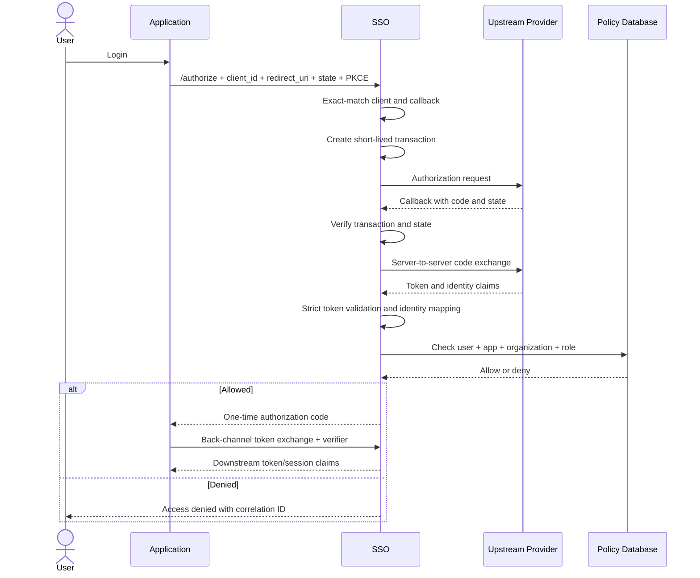

# สถาปัตยกรรม SSO

## ขอบเขตระบบ

ระบบแบ่งเป็น 5 ส่วน:

1. **Downstream OIDC layer** ออก authorization code และ token ให้เว็บไซต์ของหน่วยงาน
2. **Authentication broker** เลือกและเชื่อมต่อ upstream provider
3. **Identity mapping service** ผูก external subject กับ local user
4. **Authorization policy service** ตรวจสิทธิ์ตาม application, organization, role และช่วงเวลา
5. **Administration and audit** จัดการ client, callback, grant, revocation และตรวจย้อนหลัง

## ทางเลือกที่แนะนำ

ใช้ OIDC engine ที่ผ่านการใช้งานจริงสำหรับ downstream protocol และ cryptography ส่วนโค้ดของหน่วยงานรับผิดชอบ provider adapter, identity mapping และ policy integration

หากการประเมินพบว่าผลิตภัณฑ์สำเร็จรูปไม่รองรับ upstream contract ให้สร้าง broker service แยก แต่ยังใช้ library มาตรฐานสำหรับ OAuth/OIDC และ JWT ห้ามเขียน cryptographic primitive เอง

## Login flow

## Dynamic provider selection

- application configuration ระบุ provider policy ที่อนุญาต
- request อาจส่ง provider key ได้เฉพาะเมื่อ application policy อนุญาต
- provider key ถูก resolve เป็น configuration ภายในระบบ
- URL, client secret และ signing key ไม่รับจาก browser request
- transaction ต้องผูก provider, client, redirect URI และ browser session

## Trust boundaries

- Browser ถึง SSO: untrusted input
- SSO ถึง upstream provider: trusted TLS channel แต่ payload ยังต้อง validate
- SSO ถึง policy database: sensitive boundary และต้องใช้ least privilege
- SSO ถึง application token endpoint: confidential client boundary
- Admin plane: แยกสิทธิ์และ audit จาก public login plane

## Downstream claims

ใช้ subject ภายในที่ไม่เปิดเผย CID โดยค่าเริ่มต้น ส่งเฉพาะ claim ที่แอปได้รับอนุญาต เช่น:

- `sub`
- `org_id` หรือ `hcode` ที่ถูกเลือกและได้รับสิทธิ์
- `roles`
- `auth_time`
- `amr`

ห้ามส่ง upstream token และ raw provider profile ให้ downstream application

## Failure behavior

- provider timeout: fail closed และให้ retry เริ่ม transaction ใหม่
- policy database unavailable: fail closed
- state/nonce/code invalid: ยุติ transaction และบันทึก security event
- organization หลายแห่ง: เลือกจาก intersection ระหว่าง provider profile กับ local grant
- application disabled หรือ callback mismatch: ปฏิเสธก่อน redirect ไป provider
